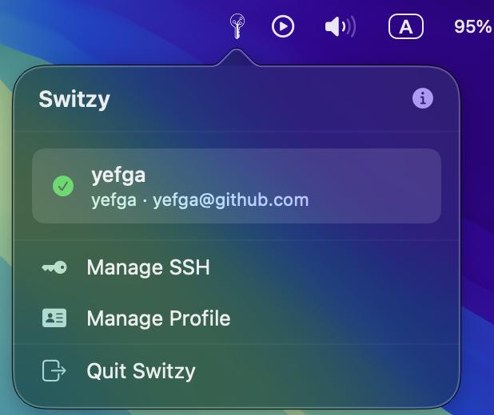

# Switzy

**Effortless Git Identity Management for macOS**

Switzy is a lightweight, premium menu bar application designed for developers who juggle multiple Git identities. It simplifies the process of switching between different Git profiles (name, email, and SSH keys) with a single click, ensuring you always commit with the right credentials.



## Core Features

- **🚀 Instant Identity Switching**: Toggle between work, personal, and project-specific Git profiles from the menu bar.
- **🔑 SSH Key Management**: Generate and manage SSH keys directly within the app without touching the terminal.
- **✨ Premium UI**: A modern, glassmorphic interface that feels right at home on macOS.
- **🔄 Auto Configuration**: Automatically updates your global or local `.gitconfig` as you switch profiles.
- **🔔 Sparkle Updates**: Receive seamless notifications when a new version is available for one-click updating.

## Installation

### Via Homebrew (Recommended)

You can install Switzy using Homebrew by tapping the official repository:

```bash
brew tap yefga/tap
brew install --cask switzy
```

### Manual Installation

1. Download the latest `.dmg` from the [Releases](https://github.com/yefga/Switzy/releases) page.
2. Open the DMG and drag **Switzy.app** into your **Applications** folder.

## 🛡️ Note on Gatekeeper (macOS Security)

As this is an open-source project and not yet notarized by Apple, you may see a warning: *"Apple could not verify “Switzy” is free of malware."*

To run the app:
1. **Right-click** on **Switzy.app** in your Applications folder.
2. Select **Open** from the menu.
3. Click **Open** again in the dialog box.

Alternatively, you can run this command in your terminal:
```bash
xattr -cr /Applications/Switzy.app
```

## Development

Switzy is built with **SwiftUI** and managed using **Tuist**.

1. Clone the repository:
   ```bash
   git clone https://github.com/yefga/Switzy.git
   cd Switzy
   ```
2. Generate the project:
   ```bash
   tuist generate
   ```
3. Open `Switzy.xcworkspace` and run the `Switzy` scheme.

## License

This project is licensed under the MIT License - see the [LICENSE](LICENSE) file for details.

---
Created by [Yefga](https://github.com/yefga)
