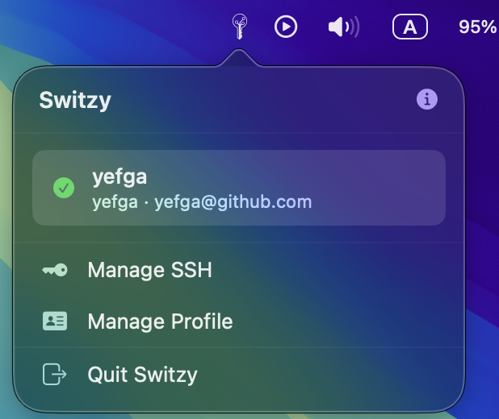

# Switzy

Switzy is a Git identity manager built around a shared Git/SSH core and platform-specific applications.

## Repository Layout

- `Shared/` contains reusable Foundation-only Git profile, Git config, shell, and SSH key logic.
- `macOS/` contains the current SwiftUI/AppKit menu bar app, Tuist project, resources, Sparkle metadata, Homebrew cask copy, and release tooling.
- `Linux/` is a placeholder for future Linux work. No Linux build is supported yet.
- `Windows/` is a placeholder for future Windows work. No Windows build is supported yet.

## macOS

Switzy's supported application is still the macOS app. Installation, development, and release notes for that app live in [macOS/README.md](macOS/README.md).

The Sparkle feed remains available at the repository root as [appcast.xml](appcast.xml) for existing macOS clients. Keep it synced with [macOS/appcast.xml](macOS/appcast.xml) until the macOS feed URL is intentionally migrated.

Linux and Windows update metadata should be chosen with those native apps later. They should not depend on the current Sparkle appcast unless a future updater is deliberately selected that supports this format.

## License

This project is licensed under the MIT License. See [LICENSE](LICENSE) for details.
